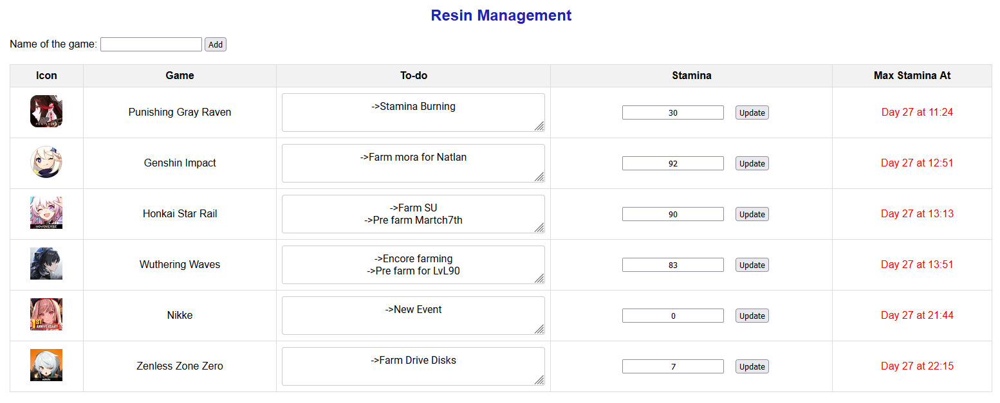
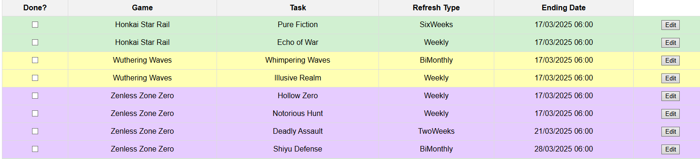

# 🎮 Gacha Management

O **Gacha Management** é uma aplicação projetada para ajudar jogadores de **gacha games** a gerenciar sua **resina/stamina** e acompanhar **tarefas recorrentes** nos jogos. Ele oferece ferramentas para rastrear a regeneração da stamina, organizar atividades programadas e facilitar o planejamento dentro dos jogos.



## 🚀 Funcionalidades

### 🏆 **Gerenciamento de Resina**
- Registre a quantidade atual de **resina/stamina**.
- Calcule automaticamente o tempo necessário para atingir o limite máximo.
- Visualize rapidamente quando sua resina estará cheia.

### 📅 **Gacha Schedule**
- **Acompanhe eventos e tarefas recorrentes** dentro dos seus jogos favoritos.
- As tarefas são **vinculadas aos jogos cadastrados** e possuem **atualização automática** com base no tipo de recorrência:
  - **Diário**
  - **Semanal**
  - **Quinzenal**
  - **Mensal**
  - **Eventos personalizados**
- Permite visualizar todas as tarefas em um **calendário simples**, evitando que você esqueça **eventos importantes**.



## 🔧 Tecnologias Utilizadas
- **HTML**, **CSS**, **JavaScript**
- **Dexie.js** (IndexedDB Wrapper para armazenamento local)
- **Node.js**
- **Jest.js** e **Babel** (para suporte a ECMAScript Modules e testes automatizados)

## 🎯 Como Usar
1. **Adicione seus jogos** ao sistema, informando o nome, abreviação e limite de stamina.
2. **Registre sua resina atual** e veja em quanto tempo ela estará cheia.
3. **Crie tarefas recorrentes** para acompanhar eventos importantes do jogo.
4. O sistema **atualiza automaticamente** as tarefas com base no período definido.

## 📥 Instalação
Para rodar o projeto localmente, siga os passos abaixo:

```bash
# Clone o repositório
git clone https://github.com/cristianworth/GachaManagement.git  
cd GachaManagement  

# Instale as dependências
npm install  

# Inicie o projeto
npm start  
```

## 🧪 Rodando Testes
O projeto usa **Jest** para testes automatizados. Para rodar os testes:

```bash
npm test
```

Certifique-se de que o Babel está configurado corretamente para suportar **ES Modules** ao rodar os testes. Caso precise configurar, adicione o seguinte no `jest.config.js`:

```js
export default {
  transform: {
    "^.+\\.js$": "babel-jest"
  },
  testEnvironment: "node",
};
```
